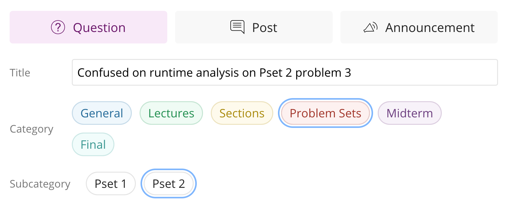
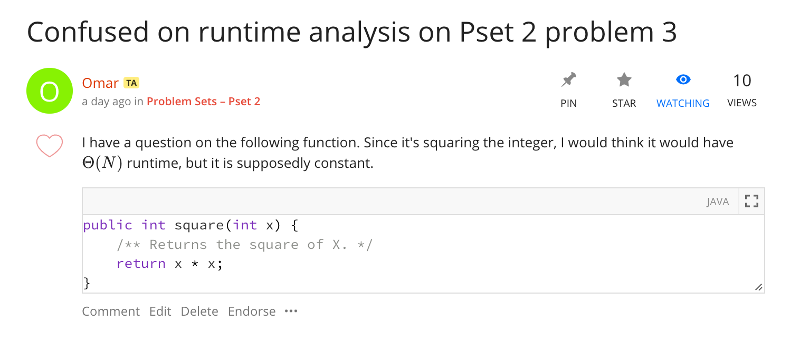

这是一份为刚开始使用 Ed 课程论坛的同学们准备的指南。它会教你如何有效地提问和高效地搜索所需内容。

总的来说，Ed 是一个以教育为中心的论坛，让你可以和其他同学异步协作，并获得老师的指导。Ed 借鉴了 StackOverflow 的一些元素。如果你不熟悉 StackOverflow，它是一个公开论坛，人们可以在上面提问关于编程和软件工程的问题。全职软件工程师也经常用它来快速获得可靠的答案，所以你也尽管用吧！查看[这个](https://stackoverflow.com/questions/3990093/java-inheritance)链接，了解发布到 StackOverflow 的示例问题。现在让我们进入 Ed。

读完这份指南，你应该会对 Ed 比较熟悉，并且能够充分利用它。让我们进入 Ed 的具体细节。

## 主页

当你第一次打开 Ed，你会看到屏幕左侧有很多帖子。所有重要的公告和索引帖子都将被**置顶**，这样你就不需要花太多时间寻找它们。帖子左边的小蓝点表示你还没看过这个帖子，所以如果在置顶帖旁边看到小蓝点，一定要仔细阅读。以下是 CS 61BL 的主页（课程的夏季版本）的样子。

记住，Ed 是我们和大家联系的主要方式。所以请务必每天都看看 Ed，尤其是在临近作业截止日期的时候，以防截止日期有变动或者我们有重要通知。

现在我们将深入探讨 Ed 的工作原理，首先是问题。

### 问题

你可以点击左上角那个大大的蓝色“New Thread（新建主题）”按钮，然后选择你想创建的内容，来发布问题或者笔记（在Ed上统称为“帖子”）。

以下是 Ed 上未解答问题的样子：

你会看到 Omar 发布了一个他需要帮助的问题。

在 Ed 中，主题下的回复和评论区分更明确。如果我对问题有疑问需要澄清，我可以对问题进行评论。但请注意，这**不是**在回答问题，所以老师和助教仍然会看到这个问题是未解决的。你可以看到 Allyson 询问了 Omar 的问题来自哪个工作表。

讲师和课程工作人员可以认可问题和答案。只有老师和助教才能认可，所以你可以更相信这个答案的正确性。如果你看到一个被认可的问题，你可能想看看它，因为它可能特别有见地！

### 答案

你可以看到 Akshit 回答了 Omar 的问题，甚至他的答案得到了认可、点赞，并且有一个绿色的勾号。我们已经讨论过认可，它只是意味着讲师或助教已经验证了这个答案是值得信赖的。每个人都可以点赞帖子、评论或答案，包括学生和工作人员。你可以将点赞视为 +1 或谢谢！

**标记为已解决的帖子**

答案旁边的绿色勾号表示它已经解决了问题。只有一个答案能被标记上绿色勾号，通常是帖子中最好的那个答案。

当老师或助教回答问题时，答案会自动被标记上绿色勾号。发布帖子的人也可以切换勾号。

如果你在 Ed 上发布了一个问题，并从你的同学那里得到了答案，请务必用绿色勾号标记它！一些学生的答案和我们的答案一样好！

反之，如果某个答案没有完全解决你的问题，请随时取消勾选！老师和助教在回答问题时会优先筛选未解决的帖子，这样你的问题就能再次被看到。

### 后续行动和评论

你也可以在答案下面以分层结构添加回复。通过这些分层评论，更容易跟踪正在发生的事情并回答个别后续问题。你可以看到 Omar 在 Akshit 的答案上提出了一个后续问题。

你可以用“Reply（回复）”来添加嵌套的回复，形成分层结构；或者用“Comment（评论）”来开启一个新的讨论串。

### 图标说明

如果对图标有疑问，可以参考下表。
|      图标      | 含义                                                                                                                                                                                   |
| :------------------------: | ----------------------------------------------------------------------------------------------------------------------------------------------------------------------------------------- |
|   | 最佳答案                                                                                                                          |
|  | 助教/老师推荐                                                                                                              |
|          | 点赞，图个开心                                                                                                        |
|         | 关注帖子，接收更新                                                                                           |
|          | 收藏帖子，方便查找                                                               |

## 如何提问

现在我们已经讨论了如何“阅读”Ed帖子，接下来我们将讨论如何编写帖子。

### 分类

分类有助于论坛保持组织性。通过为您的帖子添加类别，您可以帮助助教更快地找到并回答您的问题，还可以帮助其他学生找到您的帖子并从答案中学习。

创建帖子时，首先要做的是为其选择正确的类别，如果适用，还要选择正确的子类别和子子类别。

这是一个我将提出关于Pset（问题集）2的问题的示例：

要仅查看特定类别、子类别或子子类别中的帖子，请单击左侧边栏中的类别。

### 高级选项

您可以在帖子下方找到一些选项，可以选择匿名提问或将您的问题设为所有工作人员可见的私密问题。欢迎匿名提问。我们不鼓励提出私密问题，因为集体知识是有帮助的，但我们不会阻止您。

### 格式选项

您可能已经注意到Ed上丰富的格式选项。这包括添加图片、使用markdown、使用LaTeX以及更传统的格式，如粗体/下划线。这使得问题更易于阅读，也使得您想要问的问题更加明显和清晰。以下是所有格式选项所在的栏：

下表介绍了各个格式选项的使用方法。
|                          图标                           | 含义                                                                                                                                                                                                                                                                                                                                                                                                                                                                                                                                                                                                |
| :-----------------------------------------------------: | ------------------------------------------------------------------------------------------------------------------------------------------------------------------------------------------------------------------------------------------------------------------------------------------------------------------------------------------------------------------------------------------------------------------------------------------------------------------------------------------------------------------------------------------------------------------------------------------------------ |
|  | 点击此项会显示一个下拉菜单，其中包含各种文本类型，包括代码。虽然没有专门的 Markdown 选项，但你可以像平时一样使用反引号 \`。                                                                                                                                                                                                                                                                                                                                                                                                                                                                                               |
|                     | 这些就是常用的粗体、斜体和下划线功能。                                                                                                                                                                                                                                                                                                                                                                                                                                                                                                                                                                          |
|                                       | 这是插入代码文本的快捷方式。 建议使用交互式代码块，而不是直接使用这个。                                                                                                                                                                                                                                                                                                                                                                                                                                                                                                                           |
|                                       | 点击此按钮可以将文本[超链接](https://techterms.com/definition/hyperlink#:~:text=A%20hyperlink%20is%20a%20word,way%20from%20page%20to%20page.)到帖子中。选中需要超链接的文字，然后粘贴链接即可。                                                                                                                                                                                                                                                                                                                                          |
|                           | 创建项目符号列表和编号列表。                                                                                                                                                                                                                                                                                                                                                                                                                                                                                                                                                                     |
|                                 | 在帖子中插入图片。                                                                                                                                                                                                                                                                                                                                                                                                                                                                                                                                                                        |
|                                      | 用于嵌入视频，但通常情况下你不需要使用这个功能。                                                                                                                                                                                                                                                                                                                                                                                                                                                                                                                                                    |
|                                | 用于将文件添加到帖子，但通常情况下你不需要使用这个功能。                                                                                                                                                                                                                                                                                                                                                                                                                                                                                                                                       |
|                                      | 点击此项可以在帖子中插入 LaTeX 公式。 注意，公式会独占一行。 如果你熟悉 LaTeX，可以直接使用 `$` 符号。 如果不熟悉，也很容易上手，因为你只需要学习一些简单的渐近线相关的语法，大概 20 分钟就能搞定。                                                                                                                                                                                                                                                     |
|                           | 插入交互式代码块。 相比普通代码块，它有更好的语法高亮和自动补全括号等功能，对 Java 编程非常友好。 默认情况下，右侧的语言选项应该是 Java，如果不是，请手动修改。 你会看到“行号”和“可运行”两个复选框。 强烈建议勾选“行号”，方便调试。 “可运行”选项理论上可以运行你的代码，但对 Java 的支持不太好 (需要定义包含 `main` 函数的类)，所以建议取消勾选。 |
|                                  | 本课程用不到此功能，它用于显示基本的网页内容。                                                                                                                                                                                                                                                                                                                                                                                                                                                                                                                                  |
|                                       | 你可以用它来画图。                                                                                                                                                                                                                                                                                                                                                                                                                                                                                                                                                                         |
|                                    | 预览帖子，确保所有格式显示正确。                                                                                                                                                                                                                                                                                                                                                                                                                                                                                                                        |

在以下示例中，您可以看到 Omar 提出了一个关于特定问题集的特定问题，并对其进行了正确的分类。 现在，将来，如果另一个学生正在学习 Pset 2 并且有一些问题，他们可以简单地使用过滤器来查看该子类别中的问题，而不必提出重复的问题。

## Ed 超级帖子

我们通常会有很长的帖子（我们称之为“超级帖子”）来汇总特定主题的所有问题和说明。 超级帖子很好，因为您可以浏览其他学生在作业中遇到的问题，以获得对您的同学遇到困难的特定部分的良好“鸟瞰图”。 每个作业都有一个超级帖子，因此关于该作业的所有问题都存在于一个地方，然后您可以使用浏览器的搜索 (CMD + F) 来查找更具体的内容。 每个后续问题都可以标记为“已解决”或“未解决”，以提醒助教需要回答问题。 这样，您的问题就不会丢失，并且我们始终会知道超级帖子是否需要我们的关注。
在CS61B中，每个作业都会设立一个集中讨论帖（Megathread），大家可以将所有关于作业的问题都发到相应的帖子中。工作人员会密切监控这些集中帖，确保每个问题都能被看到，不会淹没在其他问题中。

但请大家**在提问前务必先搜索一下**，以减少版面 clutter，让Ed对大家和助教们发挥更大作用。

以下是Ed中集中讨论帖的示例：

你会看到一级评论会带有“已解决”或“未解决”的特殊标记：这样助教就能知道哪些评论需要关注。**请务必在已有评论后，将其标记为“未解决”，否则助教们不会知道你需要解答！** 点击“未解决”/“已解决”按钮即可切换状态。

要添加新评论，只需在帖子下方写着“Add comment”的文本框中开始输入即可：

你可以选择匿名提问：如果选择匿名，系统会随机分配一个匿名动物名称作为你的化名（例如，一位匿名提问的同学被命名为“Anonymous Okapi”），方便我们在后续讨论中称呼你。

默认情况下，你发布的评论会被标记为“未解决”。

集中讨论帖会被置顶，你可以在之前提到过的“置顶帖子”区域找到它们。

你还可以对集中讨论帖中的评论进行排序：

如果按“热门”排序，评论会按照点赞数从高到低排列。这将帮助你找到其他同学认为最有用的评论。如果你觉得某个评论对你有帮助，别忘了点赞，这能让排序结果更有参考价值！

如果按“未解决”排序，未解决的评论会排在前面，方便助教们优先处理需要解答的问题。当然，如果你也乐于助人，非常欢迎加入我们一起答疑解惑 :)

## 搜索

还记得我们说过Ed的搜索功能很强大吗？下面我们来详细了解Ed的搜索功能和技巧。

以下是一个良好搜索的示例：

让我们来看看如何使用所有搜索功能以及良好的搜索策略：

### 使用关键词

这是上图中红色（左上角）的框。
Ed 搜索很像 Google 搜索。例如，如果你想了解递归运行时分析，可以直接搜索“如何计算递归函数的运行时”。或者，直接搜索关键词，比如“递归 运行时 分析”，通常也能得到不错的结果。当你像之前一样提出一个格式良好的问题时，Google 实际上会为你提取关键词。虽然我们不能在 Ed 中直接输入自然语言问题，但给定正确的关键词，Ed 的搜索效果也很好。Ed不仅能搜索帖子标题和问题，还能搜索到子评论。当你输入新的帖子标题时，Ed 还会根据你输入的内容显示相关帖子。不妨先看看，说不定你的问题已经被解答了！

以下两个功能肯定会帮助你搜索，但通常情况下，正确的关键词会让相关的帖子出现在搜索结果的前面。

### 搜索过滤器

这是上图中绿色（右上角）的框。

如果你想找到比较可靠的答案，可以筛选“已认证”的帖子。这将搜索结果限制为仅包含已被工作人员认可的帖子。如果你热心助人，可以搜索未回答的问题，帮助其他同学。提前感谢！

### 搜索类别

这是上图中紫色（中心偏右）的框。

如前所述，你可以将搜索范围限定在特定类别中。例如，如果你对期中考试 1 中关于继承的问题有疑问，可以将搜索范围限定为该子类别下的帖子。

### 搜索日期范围

这是上图中蓝色（右下角）的框。

你还可以指定搜索的日期范围。这个功能可能不常用，但以防万一，它就在那里。
这是上图中蓝色框（右下角）所示。

这个功能不常用，但以备不时之需。

## 结尾

这份指南能帮你了解Ed的各项功能，但最好的学习方式还是亲身体验！请记住遵守 Ed 的礼仪，以便所有学生都能从大家提出的精彩问题中受益。

Ed官方提供了一些资源，内容是本页的精简版:

*   `https://edstem.org/us/help/student-discussion` (Ed讨论区学生帮助)
*   `https://edstem.org/quickstart/ed-discussion.pdf` (Ed讨论区快速入门指南PDF)
