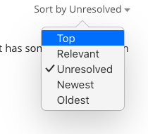
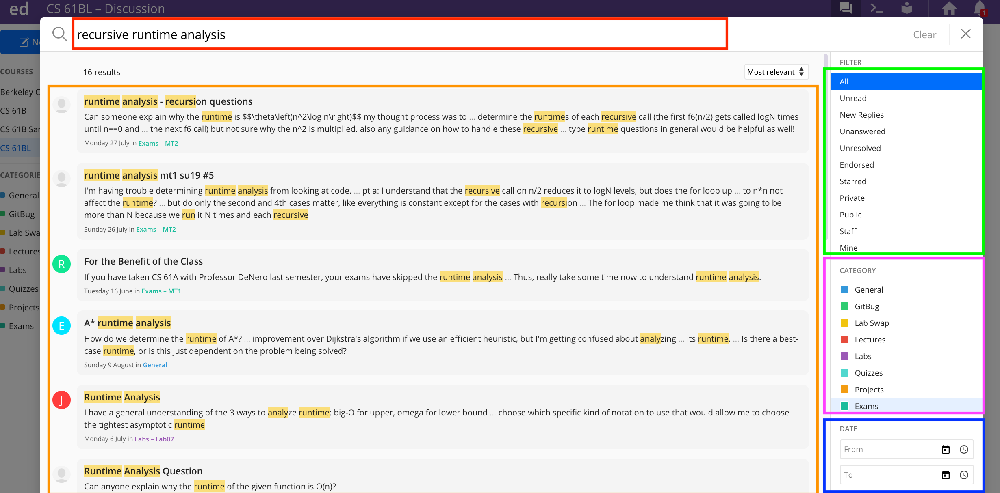

This is a guide for students new to the course forum Ed. It'll cover how to
effectively ask questions and how to efficiently search for what you want.

At a high level, Ed is an education-centric forum that allows you to asynchronously collaborate with other students and receive guidance from staff. Ed takes some elements from
StackOverflow. For those who are unfamiliar, StackOverflow is a public forum
where people ask questions related to programming and software engineering.
Full time software engineers use this all the time to get quick and reliable
answers, so you should feel free to as well!
Check out [this](https://stackoverflow.com/questions/3990093/java-inheritance)
link for an example question posted to StackOverflow. Now let's get into Ed.

After reading this guide, you should feel familiar with Ed and able to make the
most out of it. Let's get into Ed specifics.

## Landing Page

When you first visit Ed, you'll see a bunch of posts on the left side of your screen. All
important announcements and index posts will be **pinned** so that you don't
need to spend too much time looking for them. That little blue dot on the left
side of the post means that you haven't viewed that post, so if you see that
next to a pinned post you should definitely read it thoroughly. Here is what
the landing page of CS 61BL looks like (the summer version of the course).

Remember that Ed is the primary point of contact between us, so make sure you
read it every day, and pay special attention to it during and around due dates
in the case that any deadlines change or we have any important announcements.

Now we'll dive into the
specifics of how Ed works, starting with Questions.

### Question

You can create a question or note (called a "post" on Ed) by clicking the big
blue 'New Thread' button in the top left corner and then selecting what you
want to create.

Here is what an unanswered question on Ed looks like:

You'll see that Omar has posted a question that he wants help with.

In Ed, there is more distinction between follow-ups under a thread.
If I had a clarification on the question, I can comment on the question. This is
**not** answering the question, so instructors and TAs will still see the
question as unanswered. You can see that Allyson has asked
for the worksheet Omar's question is from.

Instructors
and course staff can endorse questions and answers.
Only staff and instructors can endorse, so you can have more confidence that the
answer is correct on this one. If you see an endorsed question, you may want
to check it out as it may be particularly insightful!

### Answers

You can see that Akshit has answered Omar's question and has even gotten his
answer endorsed, liked, and has a green check mark. We've already talked about
endorsement, it just means that an instructor or TA has verified this answer
is trustworthy. Everyone can like a post, comment, or an answer, both students
and staff. You can think of likes as +1s or a thank you!

**Resolving Posts**

The green checkmark next to an answer indicates that it has resolved the question. Only one answer can receive the green checkmark, so
it will be given to the best answer on the post.

When a staff member answers a
question, it is automatically marked with a green checkmark. The person that made the post can also toggle the checkmarks.

If you post a question on Ed, and get an answer from one of your fellow
students, be sure to mark it with the green checkmark! Some student answers are
just as good as ours!

On the other hand, if an answer does not fully resolve your question, feel free to unmark it! Staff filters for unresolved posts when answering Ed questions, so this will allow your question to be discovered again.

### Follow-ups and Comments

You can also create a follow-up on an answer in a hierarchical form.
With these hierarchical comments, it is much easier
to track what's going on and answer individual follow-up questions. You can see
that Omar has asked a follow-up question on Akshit's answer.

You can use "Reply" to follow up with a nested, hierarchical comment, or
"Comment" to start a different comment chain.

### Summary of Icons

Here is a reference table if you get confused.

|            Icon            | Meaning                                                                                                                                                                                   |
| :------------------------: | ----------------------------------------------------------------------------------------------------------------------------------------------------------------------------------------- |
|   | Given to just one answer on a Question, usually the best answer.                                                                                                                          |
|  | Only given by a TA or instructor that thinks the post/answer is trustworthy.                                                                                                              |
|          | Given by students or staff, not significant of anything but makes you feel better.                                                                                                        |
|         | Sets this post to be watched by you. You'll receive email updates on any activity on this post.                                                                                           |
|          | Stars this post on your account. Allows you to use a filter to see your starred post for quick access. You might consider starring helpful posts so you can easily and quickly find them. |

## Creating an Ed question

Now that we've talked about how to "read" an Ed post, we'll talk about how to
write one.

### Categories

Categories help the forum stay organized. By
adding a category to your post, you are helping TAs find your post and answer
it quicker, and also helping other students find your post and learn from
the answers.

The first thing you'll do when you create a post is to select the right
category for it and, if applicable, the right subcategory and subsubcategory.

Here is an example where I will ask a question about Pset (problem set) 2:

To view only posts in a specific category, subcategory, or subsubcategory,
click on the category in the left sidebar.

### Meta Options

You'll have some options under your post if you want to ask
anonymously or make your question private where all staff members can see.
Feel free to ask anonymously. We do discourage asking private questions, as
collective knowledge is helpful, but won't stop you.

### Formatting Options

You've probably already noticed the generous
formatting options on Ed. This includes adding pictures, using markdown,
using LaTeX, and more traditional formatting like bolding/underlining. This
makes the question much nicer to read, which makes it more obvious and clear
what you are trying to ask. Here is the bar where all the formatting options
are located:

And here is a table describing how to use each formatting option.

|                          Icon                           | Meaning                                                                                                                                                                                                                                                                                                                                                                                                                                                                                                                                                                                                |
| :-----------------------------------------------------: | ------------------------------------------------------------------------------------------------------------------------------------------------------------------------------------------------------------------------------------------------------------------------------------------------------------------------------------------------------------------------------------------------------------------------------------------------------------------------------------------------------------------------------------------------------------------------------------------------------ |
|  | Select this to get a drop-down menu of different text types, including code. There isn't an explicit markdown option, just use the backticks \` as you normally would.                                                                                                                                                                                                                                                                                                                                                                                                                                 |
|                     | These are your typical bold, italics, and underline options.                                                                                                                                                                                                                                                                                                                                                                                                                                                                                                                                           |
|                                       | This is a shortcut to the code text type. Instead of using this, you should use the interactive code block.                                                                                                                                                                                                                                                                                                                                                                                                                                                                                            |
|                                       | You can use this to [hyperlink](https://techterms.com/definition/hyperlink#:~:text=A%20hyperlink%20is%20a%20word,way%20from%20page%20to%20page.) text in your post. Highlight the word or words you want to hyperlink, click this button, and paste the link.                                                                                                                                                                                                                                                                                                                                          |
|                           | Bulleted lists and numbered lists.                                                                                                                                                                                                                                                                                                                                                                                                                                                                                                                                                                     |
|                                 | Inserts an image into the post.                                                                                                                                                                                                                                                                                                                                                                                                                                                                                                                                                                        |
|                                      | Embeds a video, you shouldn't ever have to do this.                                                                                                                                                                                                                                                                                                                                                                                                                                                                                                                                                    |
|                                | Attaches a file to the post. You shouldn't ever have to do this.                                                                                                                                                                                                                                                                                                                                                                                                                                                                                                                                       |
|                                      | Click this to insert LaTeX formatted math into your post. Unfortunately, this will create its own line. Luckily, if you know LaTeX, you can just insert your single $ signs and go for it. If you don't, it's really simple to learn since the only thing you'll ever do in LaTeX is easy asymptotics stuff. You can learn this within 20 minutes.                                                                                                                                                                                                                                                     |
|                           | Insert an interactive code block. Nicer than the normal code block since this has better syntax highlighting and things like automatic curly brace insertions, which is nice for Java. The language (on the right side) should be set to Java by default, but if it isn't go ahead and change it. You'll see 2 checkboxes for "Line Numbers" and "Runnable". There isn't any reason to not have line numbers, so keep those on. The runnable option allows us to run your code, but unfortunately it really doesn't work well with Java (you need to define a class with `main`), so uncheck this box. |
|                                  | Not useful for this class. Allows you to display basic website stuff.                                                                                                                                                                                                                                                                                                                                                                                                                                                                                                                                  |
|                                       | You can draw things with this.                                                                                                                                                                                                                                                                                                                                                                                                                                                                                                                                                                         |
|                                    | Used to preview your post to make sure all your fancy elements render properly.                                                                                                                                                                                                                                                                                                                                                                                                                                                                                                                        |

In the following example, you can see that Omar has asked a question about a
specific problem from a specific Problem Set and has categorized it properly.
Now, in the future, if another student is going through Pset 2 and has some
questions they can simply use the filter to see questions in that subcategory
and not have to ask duplicate questions.

## Ed Megathreads

We typically have very long threads (that we called "megathreads") to
aggregate all questions and clarifications for a specific topic. Megathreads
are nice because you can browse through questions other students had on the
assignment to get a good "birds eye view" of the specific parts your fellow
students were getting stuck on. There is a megathread for each assignment and
thus all questions about that assignment exist in one place, and you can
then use your browser's search (CMD + F) to find something more specific. Each
follow-up can be marked as `Resolved` or `Unresolved` to alert the TAs that a
question needs answering. This way, your question won't get lost and we'll
always know if the megathread needs our attention.

In CS61B, we will have a megathread for each assignment;
you're to post any and all questions you have about the assignment there. These
megathreads will be monitored closely by staff to ensure that all questions are
answered and nobody's question got "lost" in the sea of other student questions.

But we ask that you **please search for your question before asking** to reduce
the clutter and make Ed as effective as possible for your fellow students and
TAs.

Here is what a megathread looks like in Ed:

You'll see that the top-level comments have a special flag that says `Resolved`
or `Unresolved`: this lets the TA know whether or not this comment needs
attention. **It's important to mark your comment as `Unresolved` after you add to
an existing comment, otherwise TAs won't know that you want that question
answered!** You can mark a comment as `Unresolved`/`Resolved` by clicking the
`Unresolved`/`Resolved` button which will mark it as the opposite thing.

To add a new comment here, just start typing in the text-box right under the
post that says "Add comment":

You have the ability to ask your question anonymously: if you do, you'll be
given an anonymous animal as your pseudonym (you can see that a student asked
anonymously and was donned the name "Anonymous Okapi") that we can use to
reference you in follow-ups.

By default, when you post your comment it'll be marked as `Unresolved`.

We'll have our megathreads pinned, so you can find them under the "Pinned Posts"
section that we talked about above.

You can also sort the comments on a megathread:

If you sort by "Top", you'l get the comments in order of most liked to least
liked. This will help you find comments that fellow students found most helpful
in completing the assignment. Don't forget to like comments you find helpful to
make this sort even better!

If you sort by "Unresolved", you'll get the unresolved comments first and then
the resolved comments afterwards. This mainly helps TAs answer all the
comments that need attention, but if you like to help answer questions too
you're more than welcome to help us out :)

## Search

Remember how we said Ed search was great? Let's go over how to use all the
search features as well as good search strategies.

Here is what the results look like for a good search:

Let's go over how to use all the search features as well as good search
strategies:

### Using Keywords

This is the red (top-left) box on the image above.
Ed search is a lot like Google search. If you had a general question on how to
do recursive runtime analysis, you could search "How do I calculate runtime on
recursive functions?". Instead, you could also search for the key words in this
well formatted question, so something like "recursive runtime analysis", which
would give you even better results. When you write a well formatted question
like before, Google actually extracts the keywords for you. While we can't
write natural language questions into Ed, given the right keywords it does a
very good job. Ed is able to search not only for post/question titles,
but also down to sub comments level. As you type a new post title, it will also
show you related posts according to what you type. Make sure to check them out,
as a question you have in mind may have already been posed!

These next two features will definitely help you search, but often times the
right key words will make the right post jump to the top of the results.

### Search Filters

This is the green (top-right) box on the image above.

If you're looking for a question with an answer you can trust, you might want
to filter for only endorsed posts. This will limit your search to only posts
that have been endorsed by staff. Similarly, if you are a helpful student and
like to answer other student's questions, you can search for unanswered or
unresolved questions and help them. Thanks in advance!

### Search Categories

This is the purple (center-right) box on the image above.

Like previously mentioned, you can limit your search to just posts in particular
categories. So if there was an inheritance question on midterm 1 that you had
questions about you can filter your search to posts with that subcategory.

### Search Date Ranges

This is the blue (lower-right) box on the image above.

You can also specify a range of dates that you want to search for. Less useful,
but it exists if you need it.

## Closing

The guide is good for letting you know what things Ed offers, but the best way
to learn it is to just use the thing! Remember to keep up the Ed etiquette so that all
students can benefit from the wonderful questions you all ask :)

Ed has some official resources that are subsets of what's covered in this page:

- <https://edstem.org/us/help/student-discussion>
- <https://edstem.org/quickstart/ed-discussion.pdf>
